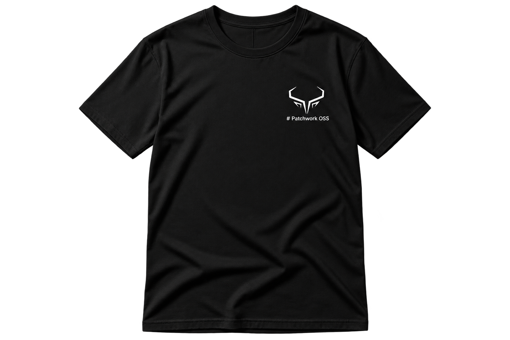

<div align="center">


# Patchwork OSS

**Every patch counts. Every contributor matters.**

An open-source contributor community where beginners find their footing and experienced developers find their people.

[](https://github.com/Patchwork-OSS)
[](https://github.com/Patchwork-OSS)
[](https://github.com/Patchwork-OSS)

</div>

---

## What is Patchwork OSS?

In software, a **patch** is a contribution — a fix, a feature, an improvement. In craft, a **patchwork** is many individual pieces stitched together into something greater than any one piece alone.

That's us.

**Patchwork OSS** is an independent, community-driven open-source contributor collective. We curate real contribution opportunities from real open-source projects and help you go from *"I want to contribute"* to *"I just got my PR merged"* — with guidance at every step.

We exist because the gap between wanting to contribute to open source and actually doing it is unnecessarily wide. Good issues are hard to find. Repos are overwhelming. Nobody tells you where to start. We fix that.

---

## Who This Is For

| If you are... | You'll find... |
|---|---|
| 🌱 **A beginner** who has never contributed to open source | Curated beginner-friendly issues with step-by-step guidance |
| 🌿 **An intermediate developer** looking to build a real contribution history | Meaningful issues across popular projects at varying difficulty levels |
| 🌳 **An experienced developer** who wants to mentor and lead | Reviewer, mentor, and maintainer roles with genuine community impact |
| 🎓 **A student** building your profile for internships or jobs | Verified contributions to real-world projects that show up on your GitHub |

Everyone starts somewhere. We make sure that somewhere isn't a dead end.

---

## How It Works

```
  ┌─────────────────────────────────────────────────────┐
  │  1. Browse curated issues from real open-source      │
  │     projects, categorized by difficulty & ecosystem  │
  │                        ↓                             │
  │  2. Pick an issue. We provide context, setup guides, │
  │     and approach hints — not just a link             │
  │                        ↓                             │
  │  3. Make your contribution. Open your PR.            │
  │     Ask for help anytime.                            │
  │                        ↓                             │
  │  4. PR gets merged by the project maintainer.        │
  │                        ↓                             │
  │  5. Submit proof. We verify. You earn recognition.   │
  └─────────────────────────────────────────────────────┘
```

**The key difference:** We don't just point you at an issue and wish you luck. Every curated issue includes the context you need to actually complete it — what the project does, how to set it up, where to look in the codebase, and what the maintainer expects.

---

## What We're Building

Patchwork OSS is being built step by step, not all at once. Here's our roadmap:

### ✅ Now
- Curated contribution opportunities from real external open-source projects
- Contribution verification (merged PRs only — no shortcuts)
- Community support via GitHub & Discord
- Clear onboarding for first-time contributors

### 🔜 Coming Soon
- Contributor progression and recognition system
- Badges for milestones and consistency
- Community leaderboard
- Mentorship program with experienced-contributor roles

### 🔮 On the Horizon
- Contributor credits system
- Community rewards and merchandise (when sustainably funded)
- Automated verification pipeline
- Dedicated community website

> [!NOTE]
> We ship when things are ready, not when a roadmap says so. Quality over speed, always.

---

## Our Principles

**📌 GitHub is the source of truth.**
All contributions, verifications, and records live on GitHub. Nothing important is locked behind a chat message.

**📌 Merged PRs or it didn't happen.**
We only count contributions that result in merged pull requests on external projects. No self-merges. No participation trophies. Real impact, verified.

**📌 We don't claim what isn't ours.**
We curate issues from projects we admire. We are not affiliated with, endorsed by, or representing those projects. Our members contribute as individuals.

**📌 Guidance, not just discovery.**
Issue aggregators already exist. We provide guided contribution — context, setup instructions, approach hints, and community support to help you succeed.

**📌 Quality over quantity.**
One thoughtful contribution is worth more than ten drive-by typo fixes. We celebrate depth.

**📌 Build in public, build incrementally.**
We're transparent about where we are and where we're going. No vaporware. No promises we can't keep.

---

## Contributor Credits

Every meaningful, verified contribution earns you **Contributor Credits** — the recognition currency of Patchwork OSS.

Credits are awarded for real work that makes a real impact:

| Contribution Type | Eligible? |
|---|---|
| 🔧 Meaningful merged pull requests | ✅ |
| 🐛 Bug fixes | ✅ |
| ✨ Feature contributions | ✅ |
| 📝 Documentation improvements | ✅ |
| 🧪 Tests and test coverage | ✅ |
| 🔍 Accepted issue discoveries | ✅ |
| 🌐 Translations (for projects supporting i18n) | ✅ |
| ❌ Trivial typo-only PRs | Not eligible |
| ❌ Automated dependency bumps | Not eligible |
| ❌ Self-merged or unverified PRs | Not eligible |

The guiding rule is simple: **if it's meaningful and verified, it counts.** If it's low-effort noise, it doesn't.

> [!NOTE]
> The exact credit values and progression tiers are currently being finalized. We're designing a system that rewards depth and quality — not one that incentivizes PR spam. Details will be published here once ready.

Credits will tie into your badges, leaderboard position, and future community rewards as the system matures.

---

## Community Goodies — *Coming Soon*

<div align="center">

We're working on bringing **exclusive Patchwork OSS community merchandise** to our most dedicated contributors.

<br>



<br>

| 🎁 Planned Goodies | Points Required | Status |
|---|---|---|
| Patchwork OSS T-Shirt | 3,000 Points | 🔜 Coming Soon |
| Sticker Packs | TBD | 🔜 Coming Soon |
| Hoodies | TBD | 🔜 Coming Soon |
| Goodie Kits | TBD | 🔜 Coming Soon |
| Community Merchandise | TBD | 🔜 Coming Soon |

</div>

> [!IMPORTANT]
> Physical rewards will only be announced when we can sustainably deliver them. We will never promise what we can't fulfill. When goodies become available, redemption details and eligibility will be published here.

---

## Get Involved

### As a Contributor

1. **Star this organization** to stay updated
2. **Browse our curated issues** (coming soon in our challenge repositories)
3. **Pick an issue** that matches your skill level
4. **Join our Discord** for support and community — *(link coming soon)*
5. **Submit your first contribution** and start your journey

### As a Mentor or Reviewer

If you're an experienced open-source contributor, we want your expertise:

- Help review and verify community contributions
- Mentor newcomers through their first PRs
- Suggest high-quality issues for curation
- Shape the direction of the community

Experienced developers can fast-track into reviewer and mentor roles — you don't need to grind through beginner milestones you've already surpassed.

---

## Community Standards

We are committed to providing a welcoming, inclusive, and harassment-free experience for everyone.

All community members are expected to:

- **Be respectful** — of each other, of external maintainers, and of the projects we contribute to
- **Be honest** — about your work, your skill level, and your contributions
- **Be helpful** — share what you know, support those who are learning
- **Represent us well** — when contributing to external projects, your PR reflects on the entire community

> A full Code of Conduct will be published in this organization.

---

## FAQ

<details>
<summary><b>Is this like Hacktoberfest?</b></summary>

Not quite. Hacktoberfest is a month-long event. Patchwork OSS is a year-round community. We focus on sustained, quality contributions — not seasonal sprints.

</details>

<details>
<summary><b>Do I need to be an experienced developer?</b></summary>

No. We actively support beginners. Our curated issues include guidance specifically designed for people making their first open-source contributions.

</details>

<details>
<summary><b>Do I need to use the curated issues, or can I find my own?</b></summary>

Both. Curated issues are a great starting point, but we also recognize and verify self-discovered contributions to external projects.

</details>

<details>
<summary><b>Is this free?</b></summary>

Yes. Patchwork OSS is and always will be free to participate in.

</details>

<details>
<summary><b>Do you guarantee rewards or merchandise?</b></summary>

We will never promise rewards we can't deliver. Physical rewards will only be announced when sustainably funded. Digital recognition (badges, leaderboards, spotlights) comes first.

</details>

<details>
<summary><b>Do I need to join Discord?</b></summary>

No. GitHub is sufficient for full participation. Discord is an optional social layer for community interaction, help, and mentorship.

</details>

---

<div align="center">

### Every patch counts.

Whether it's your first line of open-source code or your five-hundredth pull request — there's a place for you here.

**Welcome to Patchwork OSS.**

<br>

<sub>Built in public · Maintained with care · Open to all</sub>

</div>
